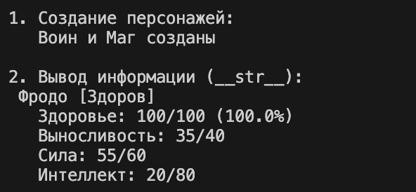
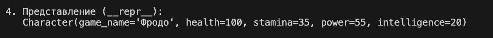
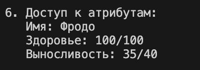

# Лабораторная работа №1

## **model.py**

## Создание класса **Character**
Создаются атрибуты
- Health
- Stamina 
- Power
- Intelligence
  
Задаются максимальные и минимальные значения для атрибутов

- Health (0-100)
- Stamina (0-40)
- Power (1-60)
- Intelligence (1-80)
  
## Создание и инициаизация нового персонажа

1. Принимаются параметры при содании персонажа (health, stamina, power, intelligence)
2. Валидация имени
   - Проверка типа данных (должна быть строка)
   - Проверяет, что имя не состоит из одних пробелов
   - Убирает лишние пробелы в начале и конце
3. Валидация и сохранение характеристик
   - Проверка типа
   - Проверка диапазона
   - Сохранение в защищенный атрибут
  
## Геттеры

Геттер — это метод, который возвращает значение защищенного атрибута. В Python геттеры создаются с помощью декоратора @property.

1. Чтение атрибута
2. Возврат значения атрибута
3. Защищает объект от неккоректного состояния

## Сеттеры

Сеттер — это метод, который устанавливает значение защищенного атрибута с проверками. 

1. Запись атрибута
2. Проверка типа и значения
3. Защищает объект от неккоректного состояния 

## Магичесские методы  

1. **`_str_`** — Строковое представление для пользователей
   
- Возвращает красивое, понятное пользователю описание персонажа
- Показывает имя, статус здоровья, все характеристики
  
2. **`_repr_`** — Официальное представление для разработчиков
   
- Возвращает подробное, техническое описание для отладки
  
3. **`_eq_`**  — Сравнение объектов

 - Позволяет сравнивать два персонажа
 - Определяет логику работы оператора `==`

## **demo.py**

## Сценарий 1

Создание персонажей и вывод информации

Сравнение через eq

Предтавение через repr

Примеры ошибок

Доступ к атрибутам 

  
Бизнес-методы 

