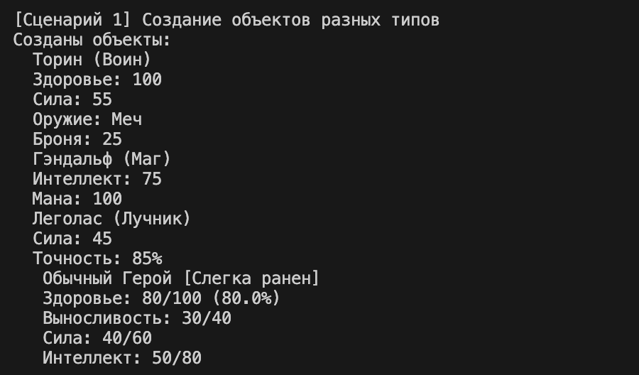

# Лабораторная работа №3

## Теоретическая часть

**Наследование** — это способ построения новой программной сущности на основе существующей, с возможностью добавления новых полей и методов, а также изменения унаследованного поведения.

- **Базовый класс (родитель)** — класс, от которого наследуют. Содержит общие характеристики для группы объектов. В вашей работе это `Character`.

- **Производный класс (дочерний, подкласс)** — класс, который наследует от базового. Добавляет специфичные атрибуты и методы. Например, `Warrior`, `Mage`, `Archer`.

### Переопределение методов

Производный класс может переопределить (заменить) метод базового класса, чтобы изменить его поведение. Для этого достаточно объявить метод с тем же именем в дочернем классе. Вызов родительской реализации можно осуществить через `super()`.

### Полиморфизм

Способность объектов разных классов отвечать на один и тот же метод по-своему. Пример: `calculate_power_rating()` для воина, мага и лучника работает по-разному.

### `super()`

Вызов метода родительского класса. Используется в конструкторе `__init__` для инициализации унаследованных атрибутов.

### `isinstance()`

`isinstance(object, classinfo)` проверяет, является ли объект экземпляром указанного класса или его потомка (проверка принадлежности объекта классу с учётом наследования).

### Атрибуты класса и атрибуты экземпляра

- **Атрибуты класса** — общие для всех объектов.
- **Атрибуты экземпляра** — уникальные для каждого объекта (создаются в `__init__`).

---

## Иерархия классов в работе

### Базовый класс `Character`

Содержит общие атрибуты:
- `_game_name` — имя персонажа (str)
- `_health` — здоровье (int, 0-100)
- `_stamina` — выносливость (int, 0-40)
- `_power` — сила (int, 1-60)
- `_intelligence` — интеллект (int, 1-80)

Методы:
- `attack(target)` — физическая атака
- `magic_attack(target)` — магическая атака
- `get_class_type()` — возвращает тип класса
- `calculate_power_rating()` — расчёт рейтинга силы
- `is_available_for_fight()` — проверка готовности к бою

---

### Класс `Warrior` (Воин)

Наследует от `Character`.

**Новые атрибуты:**
- `weapon` — оружие (str)
- `armor_rating` — рейтинг брони (int)
- `rage` — уровень ярости (int)

**Новый метод:**
- `berserker_rage()` — ярость берсерка (увеличивает урон)

**Переопределённые методы:**
- `attack(target)` — атака с бонусом от оружия и ярости
- `calculate_power_rating()` — рейтинг силы с учётом брони и оружия
- `get_class_type()` — возвращает `"Воин"`
- `__str__()` — добавляет информацию об оружии, броне и ярости

---

### Класс `Mage` (Маг)

Наследует от `Character`.

**Новые атрибуты:**
- `magic_school` — школа магии (str)
- `mana` — количество маны (int)
- `spells` — список выученных заклинаний (list)

**Новые методы:**
- `learn_spell(spell_name)` — изучение нового заклинания
- `restore_mana(amount)` — восстановление маны

**Переопределённые методы:**
- `magic_attack(target)` — магическая атака с бонусом от школы магии
- `calculate_power_rating()` — рейтинг силы с учётом маны и заклинаний
- `get_class_type()` — возвращает `"Маг"`
- `__str__()` — добавляет информацию о школе магии, мане и заклинаниях

---

### Класс `Archer` (Лучник)

Наследует от `Character`.

**Новые атрибуты:**
- `bow_type` — тип лука (str)
- `accuracy` — точность (int, %)
- `arrows` — количество стрел (int)

**Новые методы:**
- `aimed_shot(target)` — прицельный выстрел (удвоенный урон)
- `reload_arrows(count)` — пополнение стрел

**Переопределённые методы:**
- `attack(target)` — атака из лука с учётом точности
- `calculate_power_rating()` — рейтинг силы с учётом точности и стрел
- `get_class_type()` — возвращает `"Лучник"`
- `__str__()` — добавляет информацию о луке, точности и стрелах

---

## Методы классов

| Класс | Новый метод | Описание |
|-------|-------------|----------|
| `Warrior` | `berserker_rage()` | Впадает в ярость, увеличивая урон |
| `Mage` | `learn_spell(spell_name)` | Изучает новое заклинание |
| `Archer` | `aimed_shot(target)` | Наносит удвоенный урон прицельным выстрелом |

---

## Переопределённые методы

### Отличия от базового класса `Character`

| Метод | `Character` | `Warrior` | `Mage` | `Archer` |
|-------|-------------|-----------|--------|----------|
| `attack()` | `power * 2` | + бонус от оружия и ярости | не переопределён | урон зависит от точности |
| `magic_attack()` | `intelligence * 2` | не переопределён | + бонус от школы магии, расход маны | не переопределён |
| `calculate_power_rating()` | базовая формула | + бонус от брони и оружия | + бонус от маны и заклинаний | + бонус от точности и стрел |
| `get_class_type()` | `"Обычный персонаж"` | `"Воин"` | `"Маг"` | `"Лучник"` |
| `__str__()` | базовая информация | + оружие, броня, ярость | + школа магии, мана, заклинания | + тип лука, точность, стрелы |

---

## demo.py

## Сценарий 1: Создание объектов разных типов

**Цель:** показать создание объектов базового и производных классов.

### Действия:
- Создаются объекты: `Character` (обычный герой), `Warrior` (воин), `Mage` (маг), `Archer` (лучник)
- Для каждого объекта выводится информация с помощью переопределённого метода `__str__()`

### Вывод:

---

## Сценарий 2: Уникальные методы дочерних классов

**Цель:** продемонстрировать работу новых методов, добавленных в производные классы.

### Действия:
- Для воина вызывается метод `berserker_rage()` — ярость берсерка
- Для мага вызывается метод `learn_spell()` — изучение заклинания
- Для лучника вызывается метод `aimed_shot()` — прицельный выстрел

### Вывод:

---

## Сценарий 3: Переопределённые методы

**Цель:** показать, что методы `attack()` и `magic_attack()` работают по-разному в зависимости от класса.

### Действия:
- Воин атакует цель (учитывает оружие и ярость)
- Маг использует магическую атаку (учитывает школу магии и ману)
- Лучник атакует из лука (учитывает точность)

### Вывод:

---

## Сценарий 4: Полиморфизм

**Цель:** продемонстрировать полиморфное поведение метода `calculate_power_rating()` — один и тот же метод вызывает разное поведение у разных классов.

### Действия:
- Для всех объектов (воин, маг, лучник, обычный персонаж) вызывается метод `calculate_power_rating()`
- Результаты разные, хотя вызов одинаковый — это полиморфизм

### Вывод:

---

## Сценарий 5: Проверка типов через `isinstance()`

**Цель:** показать использование функции `isinstance()` для проверки принадлежности объекта к классу (с учётом наследования).

### Действия:
- Для каждого объекта проверяется, является ли он экземпляром `Character`, `Warrior`, `Mage`, `Archer`

### Вывод:

---

## Сценарий 6: Интеграция с коллекцией

**Цель:** показать, что коллекция `CharacterCollection` из ЛР-2 может хранить объекты всех дочерних классов и корректно с ними работать.

### Действия:
- Создаётся коллекция `CharacterCollection`
- Добавляются объекты всех типов (воины, маги, лучники, обычные персонажи)
- Выводится количество и список всех персонажей

### Вывод:

---

## Сценарий 7: Фильтрация коллекции по типу

**Цель:** показать возможность фильтрации коллекции для получения только определённого типа объектов.

### Действия:
- С помощью `isinstance()` отбираются только воины
- Отбираются только маги
- Отбираются только лучники
- Отбираются только обычные персонажи

### Вывод:

---

## Сценарий 8: Полиморфный вызов для всей коллекции

**Цель:** продемонстрировать, что можно вызвать один и тот же метод для всех объектов коллекции, и каждый объект выполнит свою реализацию.

### Действия:
- Для каждого персонажа в коллекции вызывается метод `calculate_power_rating()`
- Выводится рейтинг силы с учётом класса персонажа

### Вывод:

