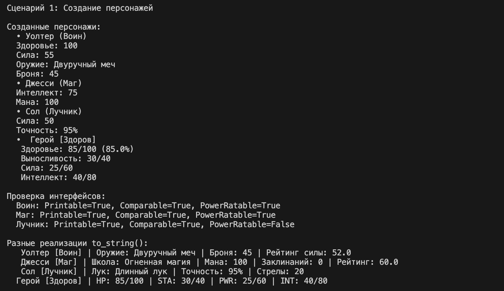
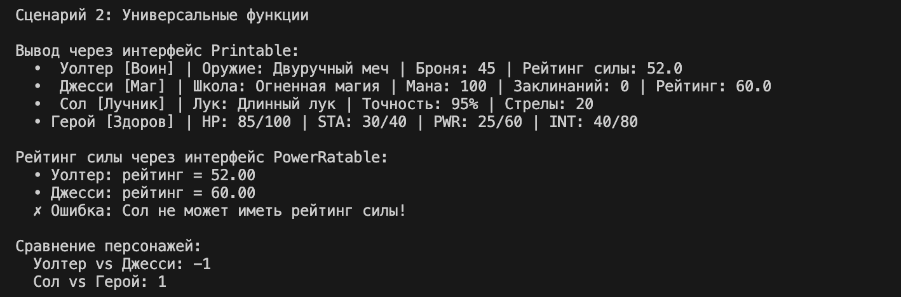
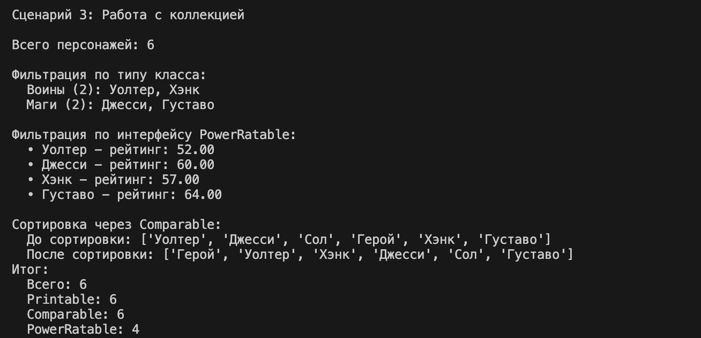

# Лабораторная работа №4: Интерфейсы и абстрактные классы (ABC)

## Теоретическое введение

**Абстрактный класс** – это класс, который не предназначен для создания экземпляров. Он служит шаблоном для других классов. Абстрактный класс может содержать абстрактные методы – методы, объявленные, но не реализованные. Любой класс, наследующий абстрактный класс, обязан реализовать все его абстрактные методы, иначе он тоже останется абстрактным.

В Python абстрактные классы создаются с помощью модуля `abc`:
- `ABC` – базовый класс для создания абстрактных классов
- `@abstractmethod` – декоратор, помечающий метод как абстрактный

**Интерфейс** – это абстрактный класс, содержащий только абстрактные методы (без реализации). Интерфейс задаёт **контракт**: класс, реализующий интерфейс, обязуется предоставить все его методы. Это позволяет различным классам иметь единое поведение.

**Полиморфизм через интерфейсы** – способность объектов разных классов отвечать на один и тот же вызов метода по-разному. При использовании интерфейсов полиморфизм достигается естественно: программа работает с объектами через общий интерфейс, не заботясь об их конкретном типе.

---

## Цель работы

- Познакомиться с абстрактными базовыми классами (ABC)
- Освоить понятие интерфейса как контракта поведения
- Научиться задавать обязательные методы для классов
- Реализовать полиморфизм через единый интерфейс
- Научиться проектировать архитектуру, а не просто классы

# Демонстрация model.py

## Сценарий 1: Создание персонажей и работа методов интерфейсов

### Что демонстрируется

Объекты разных типов (воин, маг, лучник, базовый персонаж) создаются корректно, имеют свои атрибуты, и интерфейсные методы (`to_string()`, `compare_to()`, `get_power_rating()`) вызываются и работают по-разному в зависимости от класса.

### Действия

1. **Создаются четыре объекта:** воин, маг, лучник и базовый персонаж
2. **Выводятся их строковые представления** (`__str__`), которые у каждого класса дополнены специфическими полями
3. **Проверяется реализация интерфейсов** через `isinstance()` для каждого персонажа
4. **Вызываются методы интерфейсов** с демонстрацией разного поведения

### Наблюдаемый полиморфизм

Одна и та же команда `to_string()` приводит к разному форматированию в зависимости от реального типа объекта:
- **Воин:**  выводит оружие и броню
- **Маг:**  выводит школу магии и ману
- **Лучник:**  выводит тип лука и точность
- **Базовый персонаж:** выводит характеристики в стандартном формате




## Сценарий 2: Полиморфизм через интерфейсы

### Что демонстрируется

Универсальные функции работают с любыми объектами, реализующими соответствующие интерфейсы. Демонстрируется как успешная работа, так и обработка ошибок при передаче объектов, не реализующих нужный интерфейс.

### Универсальные функции

**Функция `print_all()`:**
```python
def print_all(characters: list[Printable]):
    for char in characters:
        print(char.to_string())
```



## Сценарий 3: Коллекция и фильтрация по интерфейсу

### Что демонстрируется

Коллекция `CharacterCollection` умеет фильтровать объекты по их типу и по реализуемым интерфейсам. Это показывает, как коллекция может работать с интерфейсами, а не только с конкретными классами. Демонстрируется создание коллекции, добавление объектов, фильтрация по типу класса, фильтрация по интерфейсу и сортировка через `Comparable`.

### Методы коллекции для фильтрации

**Метод `filter_by_interface(interface_type)`:**
```python
def filter_by_interface(self, interface_type) -> List:
    """Универсальная фильтрация по любому интерфейсу или классу"""
    return [char for char in self._characters if isinstance(char, interface_type)]
```


