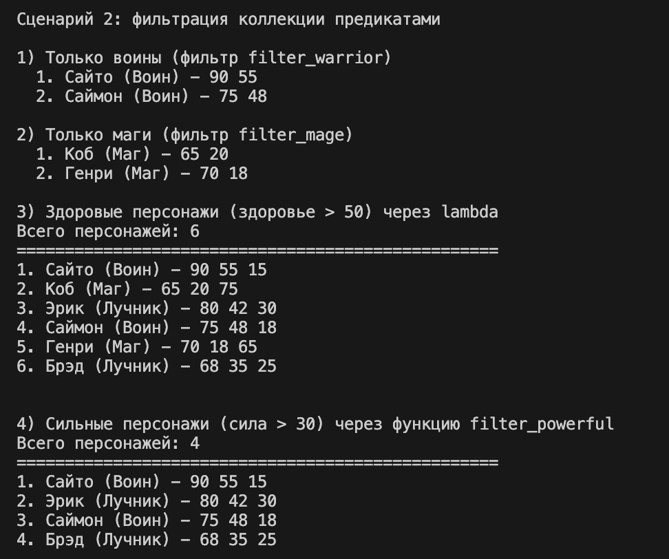

# Лабораторная работа №5: Функции как аргументы. Стратегии и делегаты

## Цель работы

Освоить функциональный стиль программирования в Python, научиться передавать функции как аргументы, применять встроенные функции высшего порядка (`map`, `filter`, `sorted`), реализовать паттерн «Стратегия» и интегрировать функциональный подход с объектно-ориентированным кодом.

## Функции высшего порядка (Higher-Order Functions)

Функция высшего порядка — это функция, которая:

- Принимает другую функцию как аргумент, **или**
- Возвращает функцию в качестве результата

Функции высшего порядка — это функции, которые работают с другими функциями, принимая их в качестве аргументов или возвращая их.

### Функции как объекты первого класса

В Python функции являются объектами первого класса, которые могут:

- Присваиваться переменным
- Передаваться как аргументы
- Возвращаться из функций
- Храниться в структурах данных

### Lambda-выражения (анонимные функции)

Lambda-функция — это небольшая анонимная функция, которая может содержать только одно выражение. Она создаётся с помощью ключевого слова `lambda` (функция используется только один раз).

Lambda-выражения в Python — это способ создания небольших анонимных функций. Они ограничены одним выражением и не содержат операторов.

**Синтаксис:** `lambda аргументы: выражение`

## Встроенные функции высшего порядка

### `map(function, iterable)` — применение функции к каждому элементу

Функция `map()` применяет переданную функцию к каждому элементу итерируемого объекта и возвращает итератор с результатами.

- `map()` возвращает итератор, который применяет функцию к каждому элементу входного итерируемого объекта.
- `map()` возвращает итератор (ленивые вычисления)
- Для получения списка нужно обернуть в `list()`
- Можно передавать несколько итерируемых объектов

### `filter(predicate, iterable)` — фильтрация элементов

Функция `filter()` создаёт итератор из элементов, для которых переданная функция-предикат возвращает `True`.

- `filter()` создаёт итератор из элементов коллекции, для которых функция-предикат возвращает `True`.
- Предикат — это функция, возвращающая булево значение (`True` или `False`). Предикаты можно передавать в `filter()` и в метод `filter_by()`.

### `sorted(iterable, key=None, reverse=False)` — сортировка

Сортировка — это упорядочивание элементов коллекции по определённому правилу. В Python для сортировки используется функция `sorted()`, которая возвращает новый отсортированный список из элементов итерируемого объекта.

**Параметры:**

- `key` — функция, возвращающая значение для сравнения
- `reverse` — если `True`, сортировка в обратном порядке

## Паттерн «Стратегия» (Strategy Pattern)

Паттерн «Стратегия» — это поведенческий паттерн проектирования, который определяет семейство алгоритмов, инкапсулирует каждый из них и делает их взаимозаменяемыми. Стратегия позволяет изменять поведение объекта во время выполнения, подставляя разные алгоритмы.

> Паттерн Стратегия определяет семейство алгоритмов, инкапсулирует каждый из них и делает их взаимозаменяемыми. Стратегия позволяет изменять алгоритм независимо от клиентов, которые его используют.

### Callable-объекты как стратегии

Python позволяет сделать объект вызываемым (callable), реализовав метод `__call__()`. Это позволяет создавать классы-стратегии с сохранением состояния.

- callable-объект можно использовать как функцию
- Может хранить внутреннее состояние
- Может иметь несколько методов
- Лучше документируется через класс
- Удобнее для сложных стратегий

### Метод `apply()`

Метод `apply(func)` применяет функцию ко всем элементам коллекции. Этот метод делает коллекцию гибкой: можно передать любую функцию для обработки элементов.

### Цепочки операций (Method Chaining)

Цепочка операций (method chaining) — это техника, при которой методы возвращают сам объект (или новый объект того же типа), что позволяет вызывать методы последовательно в одной строке.

### Фабрика функций (Function Factory)

Фабрика функций — это функция, которая создаёт и возвращает другую функцию с заданными параметрами.

# Демонстрация работы 

### Сценарий 1: Сортировка коллекции

### Сценарий 2: Фильтрация коллекции предикатами

### Сценарий 3: Map, Lambda и фабрика функций

### Сценарий 4: Паттерн стратегия через callable-объекты

