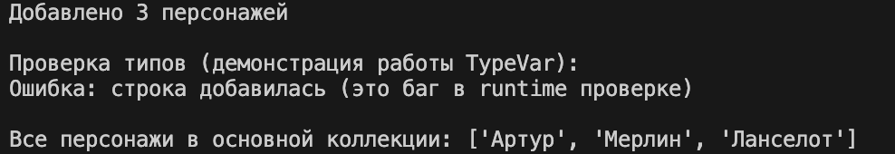

# ЛР-6 — Generics и typing

## 1. Цель работы
* Освоить систему аннотаций типов в Python (`typing`).
* Научиться создавать **обобщённые (generic) классы** с помощью `TypeVar` и `Generic`.
* Понять концепцию **структурной типизации** через `typing.Protocol`.

## 2. Описание реализованных типов и контейнеров

### Generic-классы

**Generic class** - это класс, который может работать с разными типами данных, не привязываясь к конкретному типу. Параметр типа указывается при создании экземпляра, что обеспечивает типобезопасность и переиспользование кода.

**`TypedCollection[T]`** - типизированная коллекция для хранения элементов одного типа. Обеспечивает типобезопасность и поддерживает базовые операции (добавление, удаление, получение всех элементов), а также методы поиска `find()`, фильтрации `filter()` и преобразования `map()`.

### TypeVar

**TypeVar** - это специальный объект из модуля `typing`, который используется для объявления параметров типа в generic-классах и generic-функциях. Он позволяет создавать обобщённый код, который может работать с разными типами данных.

- **`T`** - свободный тип без ограничений
- **`R`** - тип результата для метода `map()`
- **`D`** - тип с ограничением `bound=Displayable` (требует метод `display()`)
- **`S`** - тип с ограничением `bound=Scorable` (требует метод `score()`)

### Протоколы

**Protocol** - это класс из модуля `typing`, реализующий концепцию структурной типизации (утиной типизации). Протокол определяет набор методов или атрибутов, которыми должен обладать объект, без требования явного наследования.

**`Displayable`** - требует метод `display() -> str`. Соответствуют классы `Warrior`, `Mage`, `Archer`, `Player` - все они имеют этот метод для строкового отображения объекта.

**`Scorable`** - требует метод `score() -> float`. Соответствуют классы `Warrior`, `Mage`, `Archer`, `Player` - все они имеют метод для вычисления числовой характеристики (силы/мощи).

# demo.py

## Базовое использование типизированной коллекции

### Что демонстрируется

### Действия

1. Создаётся экземпляр TypedCollection с указанием типа Character
2. Создаются три объекта класса Character
3. Объекты добавляются в коллекцию с помощью метода add
4. Выводится количество добавленных персонажей
5. Демонстрируется попытка добавления строки вместо объекта Character

### Полученный вывод

---

## Методы высшего порядка find, filter, map

### Что демонстрируется

Сценарий показывает работу трёх методов высшего порядка, а также демонстрирует, как второй TypeVar R позволяет изменять тип результата при использовании метода map.

### Метод find

Принимает функцию-предикат, возвращает первый элемент, для которого предикат вернул True, или None, если такой элемент не найден.

### Метод filter

Принимает функцию-предикат, возвращает список всех элементов, для которых предикат вернул True.

### Метод map

Принимает функцию преобразования, применяет её к каждому элементу и возвращает список результатов. Тип результата может отличаться от типа исходного элемента.

### Действия

1. Поиск существующего персонажа по имени с помощью find
2. Поиск несуществующего персонажа — результат None
3. Фильтрация персонажей по силе (значение больше 40)
4. Преобразование коллекции в список имён (тип str)
5. Преобразование коллекции в список значений силы (тип int)
6. Преобразование коллекции в список рейтингов (тип float)

### Полученный вывод

---

## Структурная типизация через протоколы

### Что демонстрируется

Сценарий показывает работу протоколов Displayable и Scorable. Ключевая особенность — объекты добавляются в коллекции без явного наследования от этих протоколов. Достаточно наличия соответствующих методов (display и score).

---

### Сценарий 1. Протокол Displayable

#### Что демонстрируется

Коллекция, ограниченная протоколом Displayable, принимает любые объекты, у которых есть метод display, независимо от их иерархии наследования.

#### Действия

1. Создаётся коллекция, работающая с объектами, реализующими протокол Displayable
2. В коллекцию добавляются объекты разных классов: Character, Warrior, Mage
3. Ни один из этих классов не наследуется от Displayable
4. Для каждого объекта вызывается метод display

#### Полученный вывод

---

### Сценарий 2. Протокол Scorable

#### Что демонстрируется

Коллекция, ограниченная протоколом Scorable, принимает любые объекты, у которых есть метод score, возвращающий числовое значение.

#### Действия

1. Создаётся коллекция, работающая с объектами, реализующими протокол Scorable
2. В коллекцию добавляются объекты разных классов: Character, Warrior, Mage
3. Ни один из этих классов не наследуется от Scorable
4. Для каждого объекта вызывается метод score для получения рейтинга

#### Полученный вывод

---

### Работа методов с протоколами

#### Что демонстрируется

Методы filter и map также корректно работают с коллекциями, ограниченными протоколами, сохраняя информацию о типах.

#### Действия

1. Применение filter к Displayable коллекции для поиска объектов, содержащих слово «Воин» в выводе метода display
2. Применение map к Scorable коллекции для получения списка всех рейтингов

#### Полученный вывод

